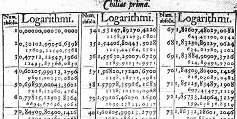

# Function families and parameters

```{r include=FALSE}
library(mosaic)
library(mosaicCalc)
library(mosaicUSAFA)
```

Throughout modeling you will hear about *functions*, *arguments*, *inputs*, and *parameters*. The distinction between arguments, inputs and parameters is a matter of perspective: what you are going to be doing with the function. Until you know some of the uses to which functions will be put, it's hard to make a clear distinction among the three. Indeed, it's not unreasonable to think of them all as the same thing: different names for the inputs to which you apply a function.

Typically when we construct models we are trying to match a pattern in a relationship. With experience, one comes to realize that there are some very common forms of relationship and we learn what kind of function is most suitable for matching the form of the relationship. For example, "unacquainted," "dating," "married," "divorced," and "widowed" are stereotypical forms of relationship between two people. Each form of relationship comes with certain expectations about how the relationship works (or doesn't). Human relationships are so rich that there can be overlap between types of relationship: some marriages are much like dating, some like divorced or even unacquainted. But there are also differences. For instance, often married couples share all finances, but dating or divorced couples typically do not.

A parameter is a quantity that points to a specific form of relationship rather than a general category. Again, human relationships are very rich, so we'll oversimplify and stereotype. Let's imagine that the parameter for functions describing human relationships is $b$, the number of years that the couple has been in the relationship. Knowing that a couple has been married  for 0.1 year gives you quite a different picture than that of a couple who have been married for 10 years, 30 years, or 50 years. Similarly, dating  relationships with a parameter of $b =$ 0.1 year are  very different than those with a  parameter of 1 year or of 10 years. The same is true for divorced couples.

In personal affairs, the relationship tells you about the kind of things the people do or don't do together. In mathematical functions, the relation is between an input and an output; knowing the input you can figure out the output. Different function forms--sine wave, straight line, exponential, logarithm--correspond more or less to the qualitative  differences in kinds of relationship, what we might call the "shape" of the relationship.

The parameters of mathematical functions take the general  kind of shape and allow it to be matched in detail to a particular situation.

Often, a different metaphor is used to explain the role and uses of parameters. If we think of an individual function as a person, we can imaging "families" of functions. The members of each family all have  some broad traits in  common. But each member has it's own distinctive identity. Within  a family  of people, we distinguish  individuals by  their first name. Within a family of functions, we distinguish individuals by parameters.

My goal here is to introduce three families of functions and some individual members of the families of particular prominence.

The three families are: Exponential, Logarithmic, Power-law.

I think that computer notation is better at giving names to the functions and in  making  it clear how the members of any one family are related to one another. Each of these functions has a single input, which traditionally but arbitrarily we call $x$ and a single parameter which I'll call `b`. Again, think of the parameter as the "first name" of the function; a way to point to  any individual member of the family.

Here they are:

* `exponential <- function(x, b) {  b^x }`, that is, `b` raised to the  power of `x`.
* `power_law <- function(x, b) { x^b }`
* `logarithm <- function(x, b) {` ???? `}`


Let's look at some family portraits of these functions. A family portrait typically involves multiple members of a family. For very large families--these function families have an infinite number of members: all the different possible values of `b`--portraits show only a few of the family members.

```{r echo=FALSE}
slice_plot(2^x ~ x, domain(x=c(-0,2)),
           label_text = "b = 2", color="blue") %>%
  slice_plot(2.5^x ~ x,  label_text="b = 2.5", color="red") %>%
  slice_plot(1.5^x ~ x, label_text="b  = 1.5") %>%
  slice_plot(1^x ~ x, label_text = "b = 1")  %>%
  slice_plot(0.5^x ~ x, label_text = "b = 1/2") %>%
  gf_labs(title = "Exponential family")
```

```{r echo=FALSE}
slice_plot(x^2 ~ x, domain(x=c(0,2)),
           label_text = "b = 2", color="blue") %>%
  slice_plot(x^2.5 ~ x,  label_text="b = 2.5", color="green") %>%
  slice_plot(x^1.5 ~ x, label_text="b  = 1.5", color="red") %>%
  slice_plot(x^1 ~ x, label_text = "b = 1")  %>%
  slice_plot(x^0 ~ x, label_text = "b = 0", color="red")  %>%
  slice_plot(x^-1 ~ x, label_text = "b = -1",
             domain(x=c(.19, 2)), color="blue")  %>%
  gf_labs(title = "Power-law family")
```

```{r echo=FALSE,  warning=FALSE}
slice_plot(log(x,2) ~ x, domain(x=c(.4,2)),
           label_text = "b = 2", color="blue") %>%
  slice_plot(log(x, 10) ~ x,  label_text="b = 10", color="green", label_x = 0.5) %>%
  slice_plot(log(x, 2.71828) ~ x, label_text="b  = 2.71828", color="red", label_x = .75) %>%
  gf_labs(title = "Logarithmic family")
```

A person glancing at these families might be tempted to say that they are all pretty much the same: the graphs are curves.  This is true, just as it's true that within and across human families people are people. But look more carefully and  you'll see that within a family, all the functions have things in common. For instance, within each  of these three families,  all the members either curve up or curve down. And within the families, all the members have identical outputs for a particular input, whether that be $x=0$ (the exponential family) or $x=1$  (the power-law and logarithmic families).

## Where's the formula for the logarithm family?

You probably noticed that in the computer-form definition for the exponential and power-law functions a specific formula was given to calculate the output from the input. Or, to be more precise, you  learned a specific mathematical notation involving superscripts to describe the function, although you probably can translate this to arithmetic only when the quantity in the  superscript is an integer.

Logarithms are different. The logarithmic function was invented by John Napier (1550-1617) and popularized as a means to perform calculations by Henry Briggs (1561-1630). Napier made up the word "logarithm." You can see in it the  start of the word  "arithmetic" and the start of the Greek word λόγος (logos), which is related to the English word "logic."

In today's language, we say that the logarithm is the *inverse function* to exponentiation. All we need to do is find the value of the exponential function for some input x and  parameter b, for instance

$$100 = 10^2\ \ \  \mbox{that is,}\ \ b^x\ \ \mbox{for}\ \ \ b = 10\ \  \mbox{and}\ \   x = 2$$

This  tells us that `logarithm(100, 10)` \rightarrow 2. This one fact isn't much use  unless we happen to want the  logarithm of 100. But the ability to calculate exponentiation means that  we  can  carry out  a search for the logarithm of whatever input we want. We need to start with two guesses, one that is too high and one that is too low. "Too high" means that $b^{guess} > x$  and too  low means that $b  ^ {guess} <  x$. This is called a bracket. Then, we try a new guess, in  the middle and see if that  is too high or too low. If too  high, we use the new guess to replace the old high guess. If too low, we use  the new guess to replace the  old low guess. Then  we repeat the process. Each time the new  bracket is  half as large as the previous bracket. After many cycles--we call these "iterations"--the bracket is so small that the too-high guess and the too-low  guess are practically the same. That  means we've arrived at the answer.

This is a description of an algorithm in words and there's not a purely algebraic notation that expresses it. But computer  programming languages were developed  to express algorithms, so here is a definition  that could be used to replace the ???? in the description above. 

```{r}
logarithm <- function(x, b = 10)  {
  bottom = -1000  # too low!
  top  = 1000     # too high!
  for (iters  in  1:50) { # repeat 50 times
    middle  <- (top + bottom) / 2
    if (b ^ middle > x) top <- middle
    else bottom <- middle
  }
  
  middle
}
```

Such algorithms rely on the ability of computers rapidly to carry out masses of arithmetic. Technological developments within living memory made this possible, particularly transistors  and integrated circuits.

In order to produce a table of logarithms to support high precision calculation in the 1600s, Henry Briggs had  to calculate, check, typeset, and print roughly 200,000 digits. By hand. This massive effort was undertaken to provide a means to speed up other calculations that were important to the day for finance, navigation, astronomy and such. To honor this heroic effort, here is a small part  of Brigg's table of logarithms, published in 1617.

```{r  echo=FALSE, out.width="80%"}

```

You can see in the table,  for instance, that $\log(67, 10) = 1.82607480270082$.

## Where things are going

As we move forward in using functions in models, you are going to see two features of how we will use parameters. First, rather than using  somewhat abstract numbers like $b$, we are going to re-write the functions in a different but equivalent form so that the parameters will have an easy-to-understand, physical meaning.  For instance, sthe parameters we will be using have names like "half-life," "doubling time," "frequency," and "period."

Second, we're going to find we need only one member of the exponential family and one member of the logarithmic family and use *unit scales* to handle the role of the parameter. This provides the opportunity to choose as the representative of the whole family a particular value of $b$ to make our lives as simple as possible. For most of us, a sensible choice would be to make the arithmetic involved in the functions as simple as possible. That would suggest, for example, $b=10$ (Henry Brigg's choice) or perhaps $b=2$ (the choice of a computer engineer who works with binary numbers). 

But, "as simple as possible" depends on the particular task you have in mind. And the tasks that shaped the decision weren't arithmetic operations but the famous operations of calculus: differentiation and integration. The result is a choice of $b$ so obscure and befuddling to anyone not doing calculus operations, that it had be be marketed with the friendly but meaningless brand name, "natural." The numerical value of this "natural" $b$ is 2.71828118459 with more digits following. The number is written named $e$,  after Leonhard **E**uler. Although entirely appropriate to honor Euler for this number, the letter $e$ is so common and easy to miss in pronounciation that it's actually hard to refer to the  number by name. (Imagine if we used $p$ instead  of $\pi$ for that famous number! Such confusion would result!) And  so we are saddled with  the wordy substitute, "the base  of the natural  logarithm."


