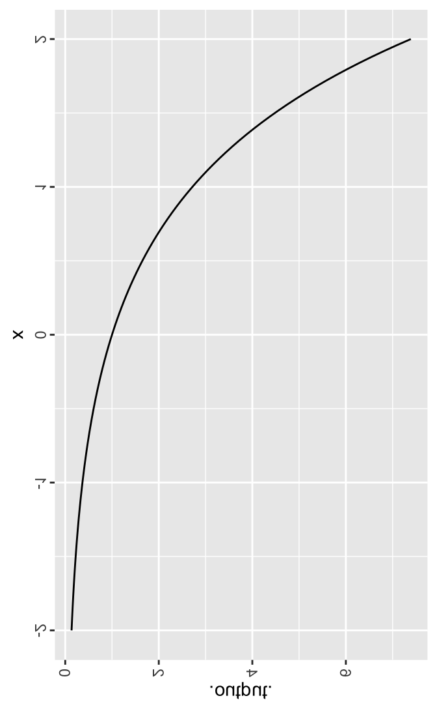

# Modeling Functions

```{r include=FALSE}
library(mosaic)
library(mosaicCalc)
library(mosaicUSAFA)
```

In the classic mystery story format, there is a set of canonical set of characters: the butler, the maid, the heiress, the seductress, and so on. Sometimes it seems to students that the functions encountered in calculus are selected along the same lines: arbitrarily selected characters that work together to create mystery.

We will be interested in practical applications of functions (of which there will be many). We will  be building functions that approximate real world patterns or mechanisms. Fortunately, we can address a huge number of problems with only a small starter set of families of functions, analogous to the different shapes in a set of wooden building blocks along with a few standard ways of putting them together.

That doesn't need to be
This essay tries to explain why that isn't really the case. The characters in the story of calculus are there for fundamental reasons.

There is a style of pedagogy that uses lists of things: verbs in foreign languages, elements in chemistry, government and economic systems. In calculus, this is manifest in the functions that are encountered as "basic":

- straight-line functions: $a + bx$
- exponentials: $e^{kt}$
- logarithms: $\ln x$
- sines: $\sin(2 * \pi t / P)$
- power-law functions: $x^3$ or $1/x^2$ or $\sqrt{x}$
- polynomials: $a + bx + cx^2 + \ldots$

You would do well to be able to recognize each of these forms of notation and assign the correct name to them. However, the basis for calling functions "basic," other than that they appear in  an early list in a textbook, is far from clear. 

I want to try to explain *why* these functions show up so often. Explaining *why* is another pedagogical technique, not necessarily  superior to the list-making approach but certainly complementary to  it. And,  perhaps it will help you to understand that calculus is getting at something fundamental about the world: it's not just a made-up cast of characters assembled to create novelty or novels.

There are two fundamental principles to keep in mind to make sense of the explanation. First, the purpose of a function is to express a relationship between two quantities. Second, ... well it turns out that the second one should best wait until we've introduced a few common kinds of relationships.

The most common kind of relationship between two things is ... I don't want to be glib, but, to be honest ... no relationship whatsoever. Or, perhaps a relationship that's so trifling that there's no reason to consider it.  Some examples: your mood as related to the gross domestic product of Zambia; the tide level in Bodega Bay, California  and the first weekend's gross receipts of some new Hollywood blockbuster; the daily change in stock market indices and just about anything else.

These (except perhaps the last) are silly because we are not in the habit of talking about the relationship between two things that don't have a relationship. But having a way to express "no relationship" must always be a part of any comprehensive way to describe relationships.

The textbook provides no name for this non-relationship sort of relationship, but nonetheless it shows up on just about every page of the book. We'll be able to think about it and recognize it better if we give it a name. Here are two; either will do.

$$\mbox{one}(x) \equiv 1 \ \ \ \ \ \ \ \ \mbox{constant}(x) \equiv 1$$

Another good name would be $\mbox{indifferent}(x) \equiv x$. This name makes clear that whatever the value of the input $x$, the output of the function is always the same: 1.

Another important relationship also is not usually given a name in calculus texts. Like $\mbox{one}()$ it shows up  on just about every page. Our name for it will be unfamiliar simply because you probably haven't seen it named before:

$$\mbox{identity}(x)  \equiv x .$$

The output is just the same as the input. Perhaps you can see why nobody bothers to name the relationship. Like the word "self" applied to people, it is so simple that it's challenging to see what could be the use.

Now for a function that you've seen before. Its name stems from a common application:

$$\mbox{square}(x) \equiv x^2 .$$ 

The eponymous relationship is that of the area of a square to the length of a side of the square.

Finally, since we will often be working with functions of two or more variables, let's define a simple but non-trivial function whose name will be unfamiliar:

$$\mbox{bilinear}(x, y) \equiv x y .$$
Chemists might recognize this function as the "Law of Mass Action."

Now that we have a collection of some basic function forms, we're in a position to discuss the second fundamental principle that underlies how we decide which functions to include in our basic collection.

A *linear combination* is a sum of elements, where each element may be multiplied by some number. A *linear combination of functions* is a sum of functions, each function having been multiplied by some number. Here, for instance, is a particularly famous linear combination of functions:

$$f(x) \equiv b * \mbox{one}(x) + m * \mbox{identity}(x) .$$ 

$b$ and $m$ are numbers, say $b = 3.2$ and $m = -1.4$. The names $b$ and $m$ are so commonly used in high-school mathematics classes that they might have suggested to you that this function has a name: the "straight-line" function. (Textbooks like to call  it the "linear" function, and it's understandable why "straight-line" suggests "linear." But we're going to save "linear" for  use in the context of "linear combinations.")

You would be justified to question the sanity of this. After all, $\mbox{one}(x) \equiv 1$ and $\mbox{identify}(x) \equiv x$ and so $f(x)$ could be written more simply as $f(x) \equiv b * 1 + m * x$ or, simplifying, $f(x) = b + m x$. But there are reasons for what seems like madness:

1. There are many functions created by linear combination other than the straight-line function.
2. The notation $b + mx$ leads many people to think about numbers when what we are talking about is functions: relationships.
3. In applications of mathematics, the linear combinations used very often include, among other functions, one() and identity().

A very common problem for which linear combinations of functions is  a solution strategy is the problem of writing down in symbols a potentially complicated-looking function, or at least a serviceable approximation to the complicated-looking function. Examples of complicated functions: the ups-and-downs in time in air pressure that we call "speech"; the spatial variations in brightness and color that we call an "image"; the response of a mechanical or electrical system (like radar) to a changing input.

The so called "inverse problem" of linear combinations is this: given the complicated functions that we want  to approximate and given a set of basic functions to combine, find the numbers by which each basic function should be multiplied to produce the best approximation to the complicated function. 

This inverse problem may seem, at first, impossibly difficult, particularly if there are a lot of basic functions. Surprisingly, in an amazing feat of mathematical logic and engineering, the inverse problem of linear combinations is completely solved and can be reliably and quickly performed by mere arithmetic.

You don't know yet what the solution to the inverse problem of linear combinations looks like, so you have to take my work for it that it is completely solved. But just knowing that there is a solution can be extremely  helpful in simplifying our view of functions. It allows us to focus just on  the basic functions without worrying about all the possible combinations. The situation is somewhat like that of the group portrait artist working with the Photoshop software. Starting with individual portraits of people, you can combine them into whatever group arrangement suits your need.

Knowing, as you do now, that the inverse problem of linear combinations is solved, you can focus on the portraits of individual functions, of which we already have four:

- one(x)
- identity(x)
- square(x)
- bilinear(x, y)

Just these four basic functions can be used to address a huge number of mathematical problems involved in statistics, biology, physics and chemistry. But of course there are many, many other functions that have something to contribute in one setting or another. 

We'll look at a few that are useful in so many common settings that any mathematically literate professional ought to know them.

## The exponential function

The *exponential function* describes situations of growth or decay in which the rate of growth is proportional to the size of the  thing itself. Some examples: the size of a population growing at a constant rate (or dying off at a constant rate); the money in a bank account earning compound interest; the amount of a radioactive substance as it changes over time; the amount of a drug in the body as it is eliminated by metabolism.

The exponential function can  be written $b^x$, which again suggests numbers rather than functions.  To  remind you that it's a function, we'll write it as $\exp(x, b)$ where you are to understand that the input is $x$ and that $b$ is a number. We'll call such fixed numbers *parameters* and $\exp(x, b)$ is a *family of functions*, one member of the family for each possible value of $b$. 

The reason $exp(x, b)$ shows up in so many real-world situations is that it is itself the solution to a basic and universal *differential equation*, a mathematical device rooted  in calculus for describing  myriad real-world  situations.

Very closely related to the exponential function, and itself the solution to a basic differential equation, are the sine and cosine function. Indeed, the relationship is so strong that physicists and engineers often write sines and cosines compactly and expressively in terms of exponential functions. Still, the sine function is usefully parameterized in a somewhat different way: $\sin(2 \pi x / P)$, where $P$ is called the *period* of the sine, the change in $x$ over which the sine completes one complete  cycle.

The equivalence between exponential functions and sine/cosine functions is far from obvious and, in a literal sense, complex. It is relatively new to  mathematics, first published in 1748 by Leonard Euler, whose work you will encounter over and over again in calculus. The famous physicist Richard Feynman called the relationship the "the most remarkable formula in mathematics." We're going to put it to the side until we undertake the analysis of differential equations, a subject of profound importance in physics and engineering.  

## Power-law functions

Another fundamental function is the power-law: 

$$\mbox{powerlaw}(x) \equiv x^b .$$
Notice that in the definition above,  $x$ signifies the input to the function and $b$  is a number: the parameter of the power-law function.

It's amazingly easy to confuse the power-law and exponential functions when they are written in traditional notation: the exponential is $b^x$ and the power-law is $x^b$. I think it's best to refer to them by word-name: exponential vs power-law.

The power-law function shows up in many contexts. Indeed, the first three of the four basic functions listed at the start of this essay are power-laws:

1. $\mbox{one}(x) \equiv 1 = x^0$, the power law with $b=0$.
2. $\mbox{identity}(x) \equiv x =  x^1$, the power law with $b = 1$.
3. $\mbox{square}(x) \equiv x = x^2$, the power law with  $b = 2$.

An example of a power-law function is seen in the familiar  quantity of "body-mass index" (BMI). The BMI is used as a medical definition of overweight and obesity. In making such a definition that is to be relevant to a broad group  of people, consideration need be taken of the evident variation in human height. A body mass that might be healthy for a short person might indicate severe underweight for a tall person. The index thus depends on both weight and height
$$\mbox{BMI}(h, w) \equiv h^{-2}  \ w$$
There is an internationally standard definition for overweight, obese, underweight, etc. in terms of BMI. For instance, 25 kg-per-square-meter is the standard upper limit for "normal" weight. (Do  not confuse "internationally standard" with "correct." Overweight and such are judgments made with a particular goal in mind. If the goal were to determine optimal weights for jockeys the standard would be very different than it would be for fullbacks. BMI is intended to be related to a general notion of "healthy," but this is a vague concept. Of course health depends on a great number of factors other than height and weight, so any definition based solely on height and weight is bound to be only a coarse approximation.)

## Inverse functions

Recall that a mathematical function represents a relationship between inputs and an output. Sometimes, we want to think about the relationship  in an inverse way: we know a quantity that is the output of a function and we want to know what input corresponds to that quantity. For  instance, suppose we  have two quantities,  $p$ and $q$. We know that there is a function that relates them which  we'll denote $q(p)$; knowing $p$ we can figure out  $q$. The inverse function would be written $p(q)$: knowing $q$ we can figure out $p$. 

"Inverse" functions are not a special kind of function. "Inverse" merely refers to the *use we have* for the function: which quantity is the input and which the output.

As an example, consider the exponential function, graphed below with $k=1$:

```{r echo=FALSE}
slice_plot(exp(x) ~ x, domain(x=range(-2,  2)))
```

To evaluate the function for a given $x$, scan vertically up from the point  on the horizontal axis that corresponds to $x$. The vertical position of the curve for that $x$ gives the function output, which  you can read off the vertical axis.

The graph simultaneously represents the inverse function. The only thing that's different is the way we use the axes. Scan horizontally from the given value (marked as "output" in the graph) to the curve, then vertically down to  the horizontal axis from which  you  can read off the output  of the inverse function (marked as "x"  in the graph.)

In other words, the graph shows a relationship and the relationship can be read either $x \rightarrow $ output  or  output $\rightarrow x$.

But, if you  absolutely insist that the input  to a function must  always be on the horizontal axis and the output  on  a vertical axis, then the inverse function will  be a different curve than the original. Like this:

```{r echo=FALSE}

```
I made the graph by the universal method for drawing graphs of inverse functions. Make a graph  of  the original function on a transparent card, put your fingers on the NW and SE corners of the card, and use your right thumb to flip the card around the diagonal. Of course, I should have relabeled the axes so that the numerals show up in the usual way.

So far, I've reduced the set of basic functions to two types:

- exponential functions
- power-law functions

I've promised that sine functions are somehow the same as exponential functions, but I haven't yet demonstrated that equivalence.  

Now we'll add in the inverse functions for each of these two types.

- inverse of exponential function: the "log" function. 

Exponentials and logs are actually families of functions, the individual members of the family being identified by the parameter $b$. In traditional notation the $b$ is written in two different places:

$$ \mbox{exp}(x, b) \equiv b^x \ \ \ \ \ \ \ \mbox{log}(x, b)  \equiv \log_b(x)$$


- inverse of power-law function: turns out that this  is also a power-law function.

$$  \mbox{inverse_powerlaw}(x, b) = \mbox{powerlaw}(x, -b)$$

The list now has three members. Using $x$  to stand for the input  and  $b$ for the  parameter

- exponential functions $b^x$
- log functions $\log_b(x)$
- power-law functions $x^b$

And, of course, we can use linear combinations of these to produce an infinite number of other functions based on these atoms.


